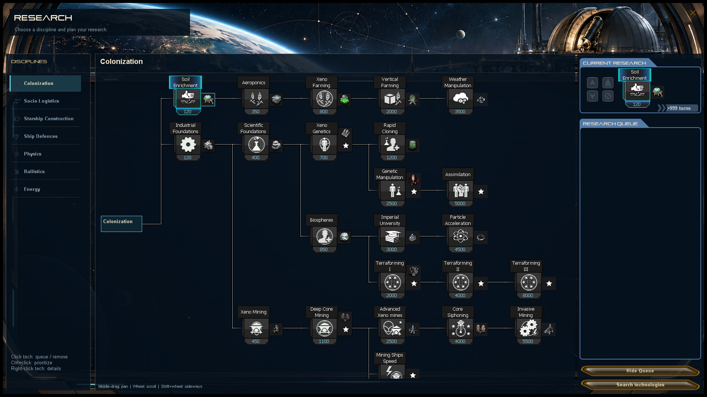

# Research screen refactor

The research screen now uses a dedicated observatory background, compact category
icons, and a fixed-height, independently scrollable category rail. Categories are
still discovered root technologies ordered by `Tech.RootNode`; adding roots does
not require changing the layout or artwork. Missing category artwork uses the
science icon. Long category labels are limited to two lines with full hover text.

The selected category anchors the tree inside a clipped viewport. Middle-drag
pans the tree; the wheel scrolls vertically and Shift+wheel horizontally. Choosing
a category resets its view. The selected root is stored using the existing save
field. Technology UIDs, prerequisites, unlock art, research progress, multi-level
technologies, queue ordering/removal, disruption indicators, and search continue
to use the existing implementations.

Queue input now uses screen coordinates, so panning the tree does not move queue
hit targets. Hidden current-research items no longer capture input. Queue visibility
and search controls occupy separate rows. An empty queue shows an explanatory label.

Production background: `game/Content/Textures/ResearchMenu/Backgrounds/observatory.png`.
Its generation prompt is retained in [research-background.prompt.txt](research-background.prompt.txt).
The original [concept PNG](research-screen-v1.png) remains a design reference;
the implementation retains the existing technology cards and queue controls.

`UnitTests/UI/ResearchScreenTests.cs` exercises category discovery/order/selection,
missing saved-category fallback, pan reset, adding research, fixed queue hit
targets, hidden-queue input, and control separation at 1920x1080, 1280x720, and
1024x768. It captures actual renders in `output/imagegen/research-refactor-*.png`.
Technology-unlock regression tests are in `TestTechnologyUnlock`.
