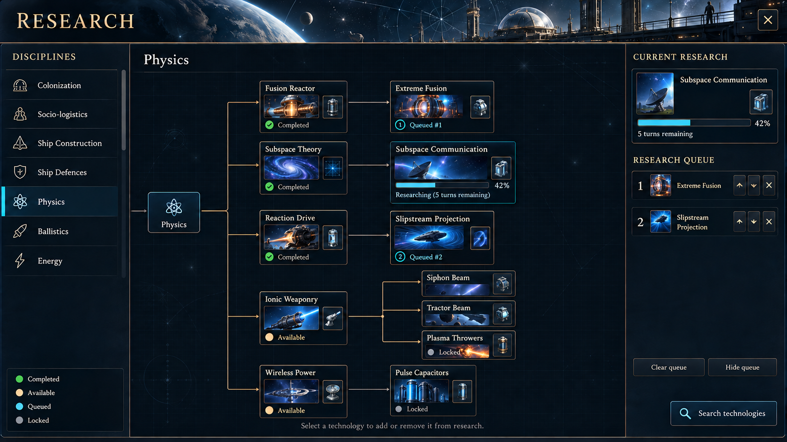

# Research screen concept v1

This is a visual proposal, not an implemented screen. Technology artwork, labels,
progress and completion values in the illustration are illustrative.

## Compatibility approach

- Keep the existing discovered root technologies, sorted by `Tech.RootNode`, and
  selection saved through `ResearchRootUIDToDisplay`.
- Replace large root illustrations (currently 78 by 58 pixels) with approximately
  20–24 pixel glyphs beside text in consistent-height rows. Retain the existing
  category identities and order; hidden roots remain hidden until discovered.
- Make the category list independently scrollable instead of dividing the screen
  height by the number of roots. New roots then use the same row template. Provide
  a generic fallback glyph so a new category does not require dedicated artwork.
- Preserve `SubNodes`, technology UIDs, prerequisites, unlock thumbnails, node click
  behavior, progress and the existing tree layout logic. Use a selected-root anchor
  in the canvas so connectors do not depend on a scrolled category row's location.
- Keep the existing `ResearchQueueUIComponent`, reorder/remove controls, current
  research, hide-queue action, disruption indicator when applicable, and
  `SearchTechScreen` action. The mockup depicts the normal undisrupted state.
- Use a separate background texture behind the controls. Do not bake labels,
  categories, progress bars or technology cards into the production texture.
- Clip tree drawing/input to its canvas and category drawing/input to its rail.
  At smaller resolutions reduce decorative spacing before shrinking readable text.

These are implementation constraints to avoid gameplay and save-format changes;
the concept itself does not establish runtime compatibility. UI layout/input
regression checks would still be needed when implementing it.

## Generation

Created with built-in imagegen. Final image: `research-screen-v1.png`.

### Initial prompt

Use case: ui-mockup
Asset type: high-fidelity PNG design concept for StarDrive PC space strategy game's RESEARCH screen. Landscape 1920x1080, crisp text, flat front-on screenshot with no monitor frame.
Primary request: visually modernize an existing research UI conservatively, reduce oversized category icons and support more future categories without altering the underlying technology graph or research queue behavior.
Visual identity: understated midnight-navy brushed metal and smoky glass, thin muted bronze structural lines, warm cream text, teal/cyan science accents. A NEW bespoke orbital observatory / research station background texture: narrow panoramic top header with a distant planet, delicate star maps and laboratory gantries. The actual tech canvas must be dark and extremely low-contrast, with subtle blueprint grid. Artwork around top/perimeter, never behind text brightly. Elegant readable classic 4X game UI, not a website, no excessive neon.
Layout: preserve LEFT category navigation, large CENTER technology-tree canvas, RIGHT fixed research queue about 330px wide. Header only 90px tall to reserve space for research. Title 'RESEARCH' upper left; subtitle 'Physics' in canvas header; close X upper right.
LEFT rail about 240px wide under header, heading 'DISCIPLINES'. Replace huge category illustrations with tiny simple 20px monochrome line glyphs beside strong readable text, uniform 44px rows, NOT large badges or giant cards. Exactly seven existing visible rows in this order: 'Colonization', 'Socio-logistics', 'Ship Construction', 'Ship Defences', 'Physics' selected with teal vertical line and subdued highlight, 'Ballistics', 'Energy'. Narrow vertical scroll track at edge demonstrates independently scrollable navigation; ample usable room below these rows. No fake new technology categories or plus/create-category button. Bottom left a small modest status legend with labels 'Completed', 'Available', 'Queued', 'Locked' and corresponding green, cream, cyan, muted gray dots. This rail must be capable of displaying any number of data-driven discovered categories with overflow scrolling, not a hard-coded equal division of screen height.
CENTER canvas around 1270px wide: connected left-to-right prerequisite tree, compact technology cards roughly 150x105px with small existing-style detailed raster technology thumbnail, technology name above or inside, a tiny attached unlock-thumbnail cell, completion/check or queued state below. Thin orthogonal connector lines connect cleanly behind cards, never crossing text. Keep nodes as a tree graph, not a table or a dashboard of unrelated cards. A small 'PHYSICS' root anchor at left of canvas splits into five horizontally progressing branches, arranged in five spacious vertical lanes. Exactly these first-tier technologies and next-stage connections:
Fusion Reactor -> Extreme Fusion.
Subspace Theory -> Subspace Communication.
Reaction Drive -> Slipstream Projection.
Ionic Weaponry -> three compact children Siphon Beam, Tractor Beam, Plasma Throwers.
Wireless Power -> Pulse Capacitors.
The first three first-tier technologies show Completed checks; Subspace Communication shows Researching with cyan partial progress; Extreme Fusion shows Queued #1; Slipstream Projection shows Queued #2; Ionic Weaponry and Wireless Power show Available; their children show subdued Locked styling. Short node labels allowed line breaks for legibility. Do not add incorrect cross-branch prerequisites. No giant images in the categories; detailed images belong to tech nodes only. Plenty of dark breathing room. Bottom canvas subtle hint 'Select a technology to add or remove it from research.' No invented zoom or reset controls.
RIGHT panel title 'CURRENT RESEARCH'. Card for 'Subspace Communication' with a small sci-fi transmitter icon, progress bar 42%, '5 turns remaining'. Beneath heading 'RESEARCH QUEUE', exactly two numbered rows: '1  Extreme Fusion', '2  Slipstream Projection'. Each row has compact up, down and remove controls. Retain existing actions 'Clear queue' and 'Hide queue' near bottom of queue. Put 'Search technologies' button at bottom right as a separate action, representing the existing search dialog. No new allocation sliders, currencies, budgets or unrelated metrics.
All text highly readable and aligned. Design must look implementable by restyling the existing root nodes, tech nodes, connectors and queue, with only category overflow navigation as a structural UI enhancement. No annotations that expose code, UID names or implementation details in the game UI. No watermark.

### Targeted graph correction

Use case: precise-object-edit
Edit target: attached research-screen concept PNG.
Preserve the complete screen composition, header observatory artwork, small-icon category rail, fonts, colors, right-hand research queue and all text. Preserve the first three tech branches exactly.
Make one targeted correction to the LOWER TECHNOLOGY GRAPH: Ionic Weaponry directly unlocks THREE SIBLINGS: Siphon Beam, Tractor Beam and Plasma Throwers. They are NOT a chain. Reflow these three children into a vertical stack of compact cards at the right side of the center tree canvas, all with the same left X coordinate, with clear spacing. Each card keeps its distinct thumbnail, name and Locked status. Draw a single thin orthogonal fan-out connector from Ionic Weaponry's RIGHT edge to a vertical junction and three separate horizontal arrows, one entering each sibling's LEFT edge. Do not connect any sibling to another. Fit the three compact cards between the Slipstream Projection lane and Pulse Capacitors lane without overlaps, and do not enter the right research-queue panel. Keep Wireless Power -> Pulse Capacitors in the lowest lane and make the root Physics branch visibly connect to Wireless Power too. Allow only the Ionic Weaponry area and its children to move as needed for this clean correct graph. All other elements unchanged.

