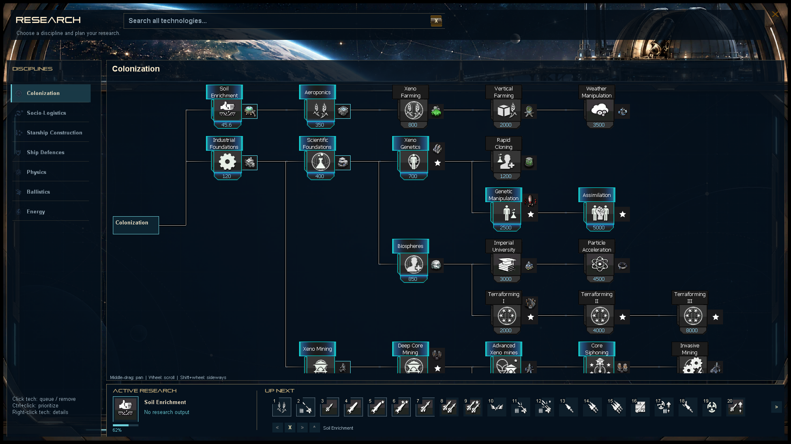

# Research screen: top search and bottom queue

The approved [concept](research-screen-v2-bottom-queue.png) is implemented using
the existing observatory texture and technology artwork.

- The top input searches all discovered non-root technologies by name, across
  disciplines. Results replace the tree while a query is present. Clicking a
  result queues it with prerequisites; completed or already queued results do
  not add duplicates. Right-click opens details. Clear or Escape restores the tree.
- The bottom dock shows one active research icon, its progress bar, percentage,
  remaining turns (or no-output status), and disruption status when applicable.
- Smaller numbered icons show subsequent research. Arrows and the mouse wheel
  reveal overflow. Select an icon to enable move earlier, remove, move later, and
  prioritize controls; hover shows its name/cost/description and right-click opens
  details. The selected name appears beside the controls.
- Existing EmpireResearch methods enforce prerequisite order and cascading
  removal. Research saves and technology data remain unchanged. No saved category
  now correctly falls back to the first discovered root.
- The category rail remains independently scrollable and the tree uses the width
  previously occupied by the side queue. Tree pan does not affect dock hit targets.

Validation: ResearchScreenTests covers category selection, first-open fallback,
cross-discipline and empty search, prerequisite queueing, queue overflow, fixed
screen-space input, independent reorder, prerequisite protection, dependent
removal, and Escape behavior. Tests capture tree and search previews at 1920x1080,
1280x720, and 1024x768 under `output/imagegen/research-dock-*.png` and
`research-search-*.png`. The technology unlock regression tests also run.

The shared workspace also required small pirate UI build corrections: premultiplied
translucent colors and using per-row ItemHeight instead of protected EntryHeight.
